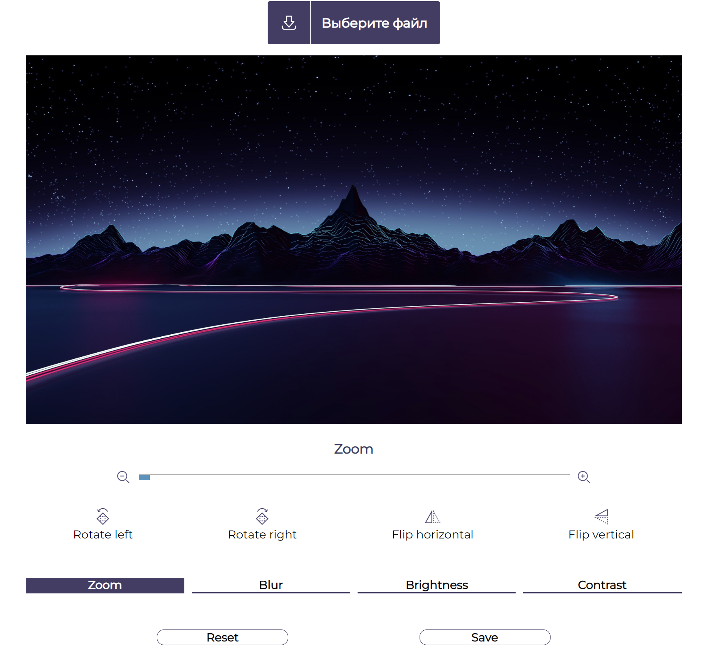

# Photo Editor JavaScript

## Features
- [x] Cropping 
- [x] Zooming
- [x] Rotate image
- [x] Flip vertical
- [x] Flip horizontal
- [x] Add blur filter 
- [x] Add brightness filter 
- [x] Add contrast filter 
- [x] Save and download edited image to your PC

## File Tree
<pre><code> 
Photo-Editor-JavaScript
 ┣ css
 ┃ ┗ style.css
 ┣ fonts
 ┃ ┣ Montserrat-Black.ttf
 ┃ ┣ Montserrat-BlackItalic.ttf
 ┃ ┣ Montserrat-Bold.ttf
 ┃ ┣ Montserrat-BoldItalic.ttf
 ┃ ┣ Montserrat-ExtraBold.ttf
 ┃ ┣ Montserrat-ExtraBoldItalic.ttf
 ┃ ┣ Montserrat-ExtraLight.ttf
 ┃ ┣ Montserrat-ExtraLightItalic.ttf
 ┃ ┣ Montserrat-Italic.ttf
 ┃ ┣ Montserrat-Light.ttf
 ┃ ┣ Montserrat-LightItalic.ttf
 ┃ ┣ Montserrat-Medium.ttf
 ┃ ┣ Montserrat-MediumItalic.ttf
 ┃ ┣ Montserrat-Regular.ttf
 ┃ ┣ Montserrat-SemiBold.ttf
 ┃ ┣ Montserrat-SemiBoldItalic.ttf
 ┃ ┣ Montserrat-Thin.ttf
 ┃ ┗ Montserrat-ThinItalic.ttf
 ┣ img
 ┃ ┣ add.svg
 ┃ ┣ default-image.jpg
 ┃ ┣ icon-flip.png
 ┃ ┣ icon-flop.png
 ┃ ┣ icon-rotate-left.png
 ┃ ┣ icon-rotate-right.png
 ┃ ┣ icon-zoom-minus.png
 ┃ ┣ icon-zoom-plus.png
 ┃ ┣ line.svg
 ┃ ┗ wavy.svg
 ┣ js
 ┃ ┣ download.js
 ┃ ┣ filters.js
 ┃ ┣ reset_save.js
 ┃ ┣ settings_menu.js
 ┃ ┗ zoom.js
 ┣ node_modules
 ┃ ┣ dom-to-image
 ┣ index.html
 ┣ LICENSE
 ┣ package-lock.json
 ┗ package.json
</code></pre>

# Screenshot Preview
</img>

## Credits

Used Dom-to-Image by [Anatolii Saienko](https://github.com/tsayen).

## License

Released under the [MIT License](http://www.opensource.org/licenses/MIT).
